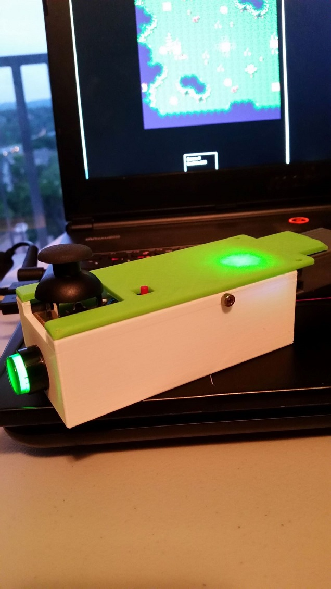
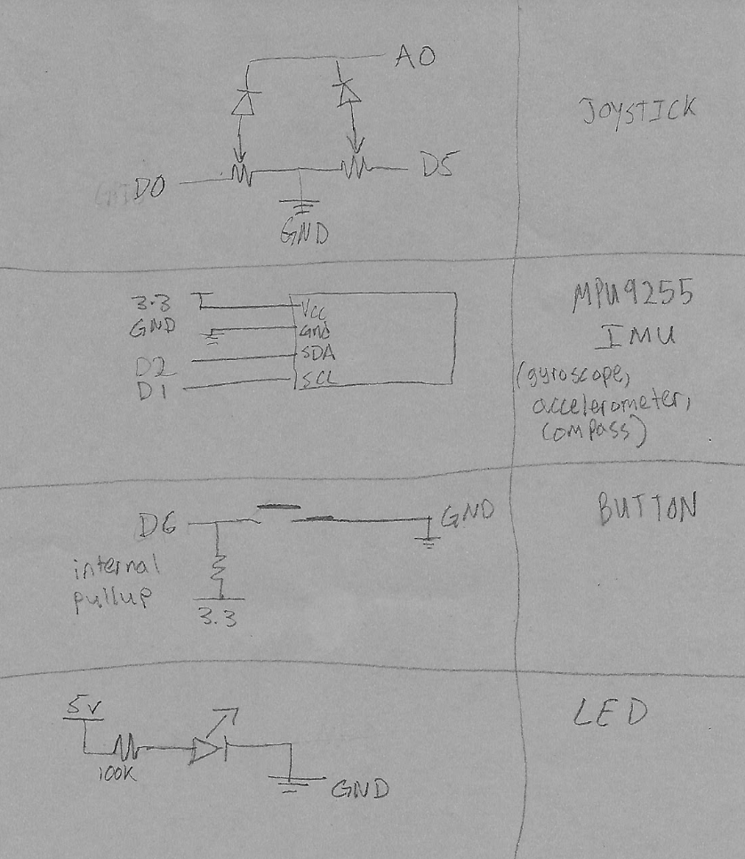

# MovementGameController
Wireless movement based game controller.  
Interfaces a joystick, buttons, 9 DOF IMU, and an ESP8266 WiFi MCU dev board. 
Programmed with Arduino WiFi and I2C Libraries.  

## About
This is a part of a final project for an Embedded Systems Design Lab. There were other parts to the project (a console and display that ran a 2P fighting game), but this is a part that I programmed, designed the circuit layout, and 3d printed parts for.  
The directions on the movement gestures need some work, I'm hoping to come back to this project and maybe just use the Espressif ESP IDF.  

## UDP Packet
Sends a packet in this format over UDP every 20ms:  
{D:idnum:q0,q1,q2,q3:x_gesture,y_gesture,z_gesture:y_rot:x_js,y_js:b_primary,b_js,b_3}  
Uses [Madgewick's IMU Algorithm](http://x-io.co.uk/open-source-imu-and-ahrs-algorithms/) to compute quaternions from the IMU data, and does some simple vector rotations to determine direction of acceleration for the gestures that happened in between transmissions.  

## Parts (links on the way)
ESP8266 12E Makerfocus Dev Board 
MPU9255 10DOF IMU - Gyroscope, Accelerometer, Compass 
Joystick - 2 axis, potentiometers. There was one ADC so took turns sampling each one. 
Large button with built in LED 
Small push button 
Small ~500mAh PulsePak microusb battery pack  

## Controller
                     

## Circuit Diagram (better one on the way)

